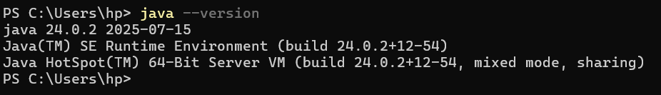
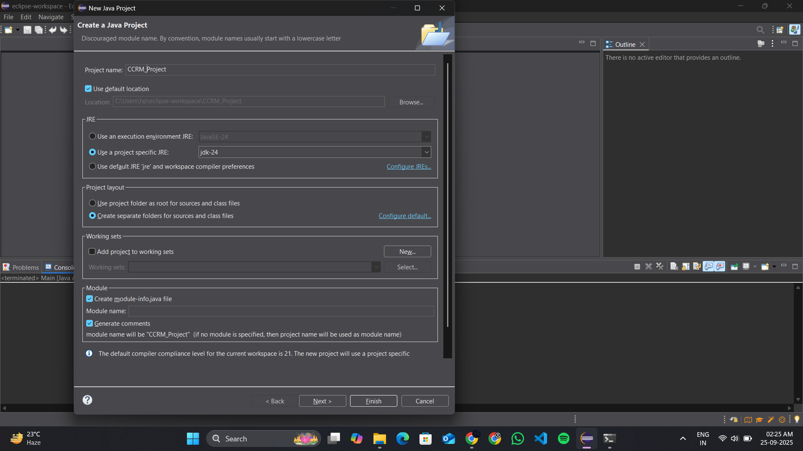
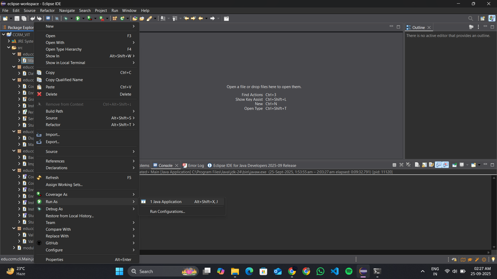

# Campus Course & Records Manager (CCRM)

This document provides a comprehensive overview of the Java technologies used in this project, along with setup and execution instructions.

***

## The Evolution of Java Timeline

Java has evolved significantly since its inception. Here are some of the key milestones:

* **1995**: **Java 1.0** is released by Sun Microsystems, introducing the "write once, run anywhere" paradigm.
* **1998**: **J2SE 1.2 (Java 2)** is a major release that introduces the Swing graphical user interface (GUI) toolkit, the Collections framework, and a Just-In-Time (JIT) compiler for performance improvements.
* **2004**: **J2SE 5.0 (Tiger)** marks a pivotal moment by adding modern language features such as **Generics**, **Enums**, **Annotations**, and **Autoboxing**.
* **2014**: **Java SE 8** revolutionizes the language with the introduction of **Lambda Expressions** and the **Stream API**, enabling a more functional style of programming. It also includes a new and improved Date and Time API (`java.time`).
* **2017**: **Java SE 9** introduces the Java Platform Module System (JPMS) to help organize large applications.
* **2018**: A new six-month release cadence begins. **Java SE 11** is released as the next Long-Term Support (LTS) version.
* **2021**: **Java SE 17**, another LTS release, adds features like Sealed Classes, Records (for concise data carrier classes), and Pattern Matching for `instanceof`.

***

## Java Editions: ME vs. SE vs. EE

Java is available in different editions tailored for various application scales and platforms.

| Feature           | Java ME (Micro Edition)                                                                    | Java SE (Standard Edition)                                                                                | Java EE (Enterprise Edition)                                                                                          |
| ----------------- | ------------------------------------------------------------------------------------------ | --------------------------------------------------------------------------------------------------------- | --------------------------------------------------------------------------------------------------------------------- |
| **Target Platform** | Resource-constrained devices like mobile phones, embedded systems, and IoT devices.        | Desktop applications, command-line tools, and servers. This CCRM project is a Java SE application.        | Large-scale, distributed, and network-centric enterprise applications.                                                |
| **Core Components** | A small subset of the Java SE API, designed for a minimal memory footprint.                  | The foundational Java platform, including the core libraries, compiler, and the Java Virtual Machine (JVM). | Builds on top of Java SE by adding a suite of powerful APIs for web services (REST, SOAP), servlets, Java Persistence (JPA), and more. |
| **Typical Use Case** | A simple game on an old feature phone or software for a smart home device.                 | A desktop application like a calculator, or a command-line tool like this CCRM project.                   | A multi-tier online banking portal, a large e-commerce website, or a complex business management system.              |

***

## Java Architecture: JDK, JRE, and JVM

The Java platform is composed of three core components that work together to enable development and execution.

* **JVM (Java Virtual Machine)**
    * **What it is**: The JVM is an abstract machine that provides the runtime environment for executing Java bytecode. It is the component that makes Java platform-independent.
    * **How it interacts**: The JVM runs on top of the host operating system and is responsible for interpreting compiled `.class` files, managing memory (garbage collection), and ensuring security. It is the "engine" that powers a Java application.

* **JRE (Java Runtime Environment)**
    * **What it is**: The JRE is the on-disk implementation of the JVM. It contains everything needed to *run* a compiled Java application, including the JVM itself and the core Java class libraries (like `java.lang` and `java.util`).
    * **How it interacts**: The JRE packages the JVM and libraries together. A user who only wants to run Java applications needs only the JRE installed. It is the complete "car" that is ready to drive.

* **JDK (Java Development Kit)**
    * **What it is**: The JDK is the complete software development kit for Java programmers. It includes everything in the JRE, plus essential development tools like the **compiler (`javac`)** and **debugger (`jdb`)**.
    * **How it interacts**: A developer uses the JDK's tools to write and compile Java source code (`.java` files) into bytecode (`.class` files). The JDK's JRE component is then used to run and test the application. It is the "factory" that builds the car (the JRE) and its engine (the JVM).


***

## Install & configure Java on Windows

### Step 1: Download and Install the JDK

1.  Navigate to the official Oracle Java downloads page and download the **x64 Installer** for a recent Long-Term Support (LTS) version, such as **JDK 17**.
2.  Run the downloaded `.exe` installer. Follow the setup wizard, accepting the default settings for the installation path (usually `C:\Program Files\Java\jdk-17`).

### Step 2: Configure Environment Variables

1.  Open the Start Menu, type `env`, and select **"Edit the system environment variables"**.
2.  In the System Properties window, click the **"Environment Variables..."** button.
3.  Under the "System variables" section, click **"New..."** to create a `JAVA_HOME` variable. Set its value to the path of your JDK installation.
4.  Find the `Path` variable in the "System variables" list, select it, and click **"Edit..."**. Click **"New"** and add a new entry: `%JAVA_HOME%\bin`. This allows you to run Java commands from any directory.

### Step 3: Verify the Installation

Open a new Command Prompt or PowerShell window and type `java -version`. The output should display the version of the JDK you just installed.



***

## Using Eclipse IDE

### Step 1: Create a New Java Project

1.  Launch Eclipse and go to **`File` > `New` > `Java Project`**.
2.  Enter a project name (e.g., `CCRM-Project`).
3.  In the "JRE" section, ensure that "Use an execution environment JRE" is set to a compatible version, like **JavaSE-17**.
4.  Click **`Finish`**.



### Step 2: Import Code and Run the Application

1.  In the "Package Explorer" on the left, right-click the `src` folder inside your new project and select **`Import...`**. Choose **`General > File System`**, browse to your `ccrm` project folder, and select the `edu` package to import.
2.  Once the files are imported, find `Main.java` in the Package Explorer.
3.  Right-click on `Main.java` and select **`Run As` > `Java Application`**. The program will start running in the Console view at the bottom of the Eclipse window.


    

***

## Syllabus Topic Mapping to Codebase

| Syllabus Topic | File / Class / Method Where Demonstrated |
| :--- | :--- |
| **Object-Oriented Programming** | `domain/Student.java`, `domain/Person.java` (Inheritance, Abstraction), `service/EnrollmentServiceImpl.java` (Polymorphism) |
| **Data Structures & Collections** | `config/DataStore.java` (HashMap), `service/StudentServiceImpl.java` (ArrayList, List) |
| **Java 8 Stream API & Lambdas** | `service/CourseServiceImpl.java` (`findCoursesByDepartment`), `io/ImportExportService.java` (export methods) |
| **File I/O (NIO.2)** | `io/ImportExportService.java` (reading/writing CSVs), `io/BackupService.java` (file copy/walk) |
| **Exception Handling** | `service/EnrollmentServiceImpl.java` (custom exceptions), `cli/Main.java` (try-catch blocks) |
| **Enums & The Builder Pattern** | `domain/Grade.java` (Enum), `domain/Course.java` (Builder Pattern) |
| **Interfaces & Abstraction** | `service/StudentService.java` (Interface), `service/StudentServiceImpl.java` (Implementation) |
| **Singleton Design Pattern** | `config/DataStore.java` (`getInstance` method) |
| **Modern Date/Time API** | `domain/Student.java` (LocalDate), `io/ImportExportService.java` (DateTimeFormatter) |

***

## Notes on Enabling Assertions

Assertions are a development tool used to verify assumptions in your code. They are disabled by default.

### How to Enable Assertions

You can enable assertions using the `-ea` or `-enableassertions` flag when running the program.

**Command-Line:**

```bash
# Enable assertions for all classes
java -ea -cp out edu.ccrm.cli.Main

# Enable assertions only for a specific package (and its subpackages)
java -ea:edu.ccrm.service... -cp out edu.ccrm.cli.Main
